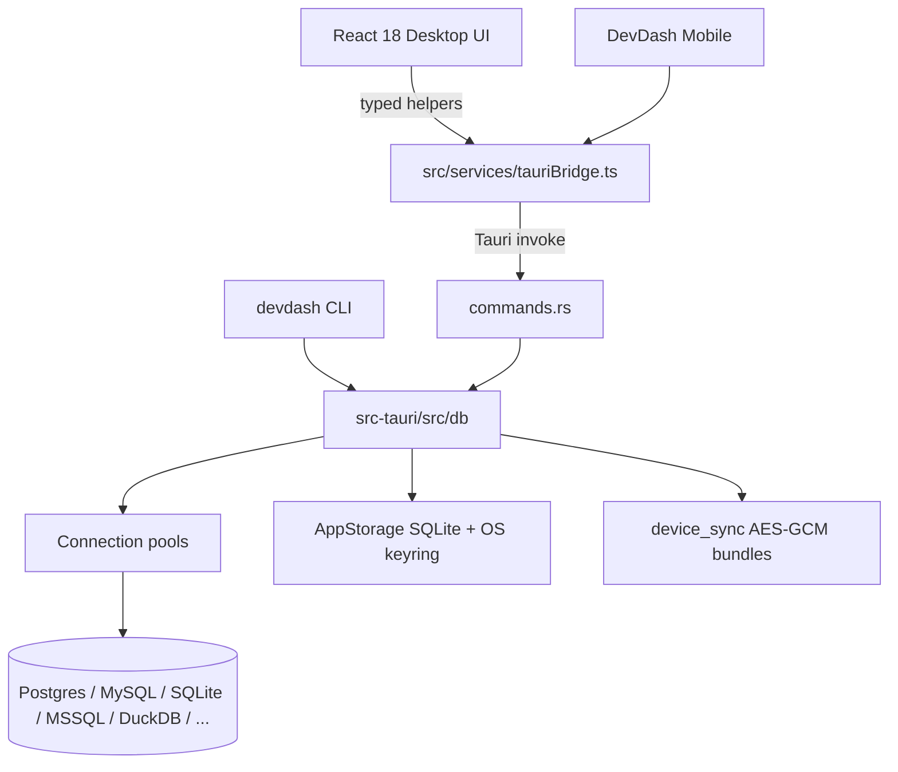

<div align="center">

# DevDash

**Local-first SQL client: Desktop, CLI, and Mobile on the same Rust engine.**

[](https://tauri.app/)
[](https://www.rust-lang.org/)
[](https://react.dev/)
[](LICENSE)
[](https://github.com/akshat-lakhera/DevDash)

[Architecture](docs/ARCHITECTURE.md) · [CLI guide](docs/CLI.md) · [Mobile](docs/MOBILE.md) · [Contributing](CONTRIBUTING.md) · [Security](SECURITY.md) · [Releases](https://github.com/akshat-lakhera/DevDash/releases/latest)

</div>

DevDash is a **local-first** database client. You connect to databases from your machine; queries run in a **Rust** backend; the UI is **React**. Nothing about your data is sent to a DevDash cloud.

There are **three front-ends** and **one engine**:

| Product | What it is |
|---------|------------|
| **DevDash Desktop** | Native GUI (Tauri 2 + React 18). Visual grid, SQL editor, staging, schema tools. |
| **DevDash CLI** (`devdash`) | Terminal companion. Same connections, keyring, Safe Mode, and query path. |
| **DevDash Mobile** | Touch-first client in the same app. Offline-first catalog/history/snapshots; optional E2E sync. |

If you are new to the repo: start with the demo below, skim [What works today](#what-works-today), then jump to [Run from source](#run-from-source) or [DevDash CLI](#devdash-cli).

---

## Demo

Live workspace interaction:

<div align="center">
  
</div>

Typical connect → explore → query flow:

<div align="center">
  
</div>

---

## Screenshots

<div align="center">
  
</div>

<div align="center">
  
  
</div>

<div align="center">
  
  
</div>

---

## Contents

1. [Who this is for](#who-this-is-for)
2. [What works today](#what-works-today)
3. [Architecture](#architecture)
4. [Download Desktop](#download-desktop)
5. [First launch on macOS and Windows](#first-launch-on-macos-and-windows)
6. [DevDash CLI](#devdash-cli)
7. [DevDash Mobile](#devdash-mobile)
8. [Run from source](#run-from-source)
9. [Repository map](#repository-map)
10. [How to contribute](#how-to-contribute)
11. [Further reading](#further-reading)
12. [License](#license)

---

## Who this is for

- **Application developers** who want a fast local GUI for Postgres, MySQL/MariaDB, SQLite, DuckDB, and related engines.
- **People who live in a terminal** and want the same connections and safety rules as the GUI (`devdash sql`, `devdash repl`).
- **People on a phone or a narrow window** who still want a real database client, not a screenshot of Desktop.
- **New contributors** who want a clear map of the codebase and a short path to `npm run tauri dev`.

You do **not** need prior Tauri experience. You do need Node.js, Rust, and (for a native app window) the [Tauri Linux/macOS/Windows system libraries](https://v2.tauri.app/start/prerequisites/).

---

## What works today

Status is from the current code, not a roadmap. Meanings:

| Status | Meaning |
|--------|---------|
| **Complete** | UI (or CLI) through Rust IPC to a real engine |
| **Partial** | Real backend pieces; UX, coverage, or engine support is incomplete |
| **Missing** | Not implemented (UI option may still exist) |
| **Unverified** | Claim exists; not measured in CI |

### Engines

| Capability | Status | Where to look |
|------------|:------:|---------------|
| PostgreSQL, MySQL/MariaDB, SQLite | Complete | `sqlx` in `src-tauri/Cargo.toml`, `pool.rs`, `executor.rs` |
| MSSQL | Complete | `tiberius` + `bb8-tiberius` native pool |
| Redis, MongoDB, Cassandra/Scylla, ClickHouse | Complete | Native clients on `ManagedConnection` |
| DuckDB, Turso (libSQL HTTP v2) | Complete | `duckdb_engine.rs`, `turso_engine.rs` |
| CockroachDB / Redshift | Partial | Postgres wire protocol; not separately tested |
| Oracle / Snowflake | Partial | Dedicated stubs; connect/query return structured errors |
| BigQuery | Missing | UI option; backend rejects |
| Cloud IAM | Missing | Struct stub only |

### Core workflows

| Capability | Status | Notes |
|------------|:------:|-------|
| Connect, introspect, run SQL, stream results | Complete | 500-row IPC chunks |
| Multi-connection workspaces | Complete | Switch pools without disconnect |
| Transactions | Complete | BEGIN / COMMIT / ROLLBACK on a held connection |
| Staging + transactional commit | Complete | Escaped-literal SQL, not bind parameters |
| Safe Mode | Complete | Blocks DROP / unbounded DELETE–UPDATE until confirm |
| Prod environment tag | Complete | Production connections are read-only unless you opt in |
| OS keychain passwords | Complete | `keyring` service `devdash_app` |
| Schema explorer, views, autocomplete | Complete | Strongest on Postgres-family catalogs |
| Schema diff + migration apply | Complete | Two connected DBs; dry-run or transactional apply |
| Diagnostics, EXPLAIN profiling | Complete | PG / MySQL / SQLite (plan quality varies) |
| Process / roles / routines managers | Complete | Live catalog SQL on PG/MySQL; N/A for SQLite |
| CSV / SQL import, full-table export, Parquet | Complete | Parquet via Arrow + Snappy |
| Result snapshots + row diff | Complete | Local AppStorage; first-column key; 100k row cap |
| Encrypted connection share + QR | Complete | AES-256-GCM; large payloads fall back to text |
| DevDash CLI | Complete | Same engine; see [`docs/CLI.md`](docs/CLI.md) |
| DevDash Mobile (touch client) | Complete | Dedicated `src/mobile` shell + shared catalog/sync; see [`docs/MOBILE.md`](docs/MOBILE.md) |
| Optional E2E device sync | Complete | AES-GCM `.ddsync`; LWW + keep-local ties; no cloud |
| SSH tunnel | Partial | Local forward works; session model is limited |
| Health / metrics grid | Partial | Depends on engine stats extensions |
| Visual query builder | Partial | Client SQL generator only |
| Audit log | Partial | Local JSONL — not SOC 2 / HIPAA |
| PII masking | Partial | Display + export; HASH is a fingerprint, not crypto SHA-256 |
| Native Android/iOS store apps | Missing | Touch client is real; Play/App Store NDK packaging is not in CI |
| RAM / binary-size claims | Unverified | Not measured in CI |

---

## Architecture

React never talks to databases directly. Components call helpers in `src/services/tauriBridge.ts`, which invoke Rust commands. The CLI skips the UI and calls the same `src-tauri/src/db/*` modules.



<div align="center">
  
</div>

Rules worth knowing before you edit code:

1. UI components must not call raw `invoke('...')` — go through `tauriBridge.ts` (`npm run test:arch` checks this).
2. Passwords belong in the OS keyring, not in `connections.json` or git.
3. Destructive SQL is analyzed in `safe_mode.rs` on the server, not only in the UI.
4. Desktop uses Cargo feature `gui` (default). CLI uses `--no-default-features --features cli` and does not link WebKit.
5. Mobile is another React shell over the same IPC. Connection SSOT is `connections.json`; optional sync is `device_sync.rs`.

Deeper write-up: [`docs/ARCHITECTURE.md`](docs/ARCHITECTURE.md).

---

## Download Desktop

Pre-built installers, when published, are on [GitHub Releases](https://github.com/akshat-lakhera/DevDash/releases/latest):

| Platform | Typical asset |
|----------|----------------|
| Windows | `DevDash-Setup-x64.exe` or `.msi` |
| macOS | `DevDash-x64-arm64.dmg` (Apple Silicon and Intel) |
| Linux | `.AppImage` or `.deb` |

Release CI currently targets **desktop installers** (Windows, macOS, Linux). There is no Android APK job in this repository. The Mobile client still runs in the desktop window (narrow width or `?mobile=1`).

If a release is missing for your OS, [build from source](#run-from-source).

---

## First launch on macOS and Windows

Installers are built from this open-source tree **without** a paid Apple/Microsoft developer certificate. Gatekeeper and SmartScreen often warn on first open. That is expected.

**macOS**

1. Preferred: in Finder, right-click `DevDash.app` → **Open** → **Open Anyway**.
2. Or remove the quarantine flag:

```bash
xattr -d com.apple.quarantine /Applications/DevDash.app
```

Do not disable Gatekeeper system-wide unless you understand the risk.

**Windows**

On “Windows protected your PC”, click **More info** → **Run anyway**.

---

## DevDash CLI

The CLI is the same product in a terminal: same catalog (`~/.config/devdash/connections.json`), same keyring, same Safe Mode, same AppStorage history and snapshots.

Until the install script is on `main`, install from a clone:

```bash
cargo install --path src-tauri --bin devdash --locked --no-default-features --features cli
```

Then:

```bash
devdash doctor
devdash connect add --name local --url 'postgres://user@localhost:5432/app'
devdash connect test
devdash sql 'select 1'
devdash repl
```

Full v1 guide (command tree, config precedence, exit codes, scripting, troubleshooting): **[`docs/CLI.md`](docs/CLI.md)**.

Cross-device (optional):

```bash
devdash sync export -o bundle.ddsync --passphrase 'correct horse battery'
devdash sync import -f bundle.ddsync --passphrase 'correct horse battery'
```

---

## DevDash Mobile

The mobile client is the same product on a phone-sized surface: shared catalog, keyring, Safe Mode, diagnostics, AI assist, snapshots, and history. It is a dedicated touch UI (`src/mobile`), not a CSS wrap of the desktop grid.

Try it in the desktop window: shrink below 768px, or open with `?mobile=1`.

Full guide (offline-first rules, sync, packaging honesty): **[`docs/MOBILE.md`](docs/MOBILE.md)**.

Native Play Store / App Store packages are not in CI yet (DuckDB/ssh2 NDK). The client itself does not wait on that.

---

## Run from source

### Prerequisites

| Tool | Version (practical minimum) |
|------|-----------------------------|
| Node.js | 18+ (CI uses 22) |
| npm | comes with Node |
| Rust + Cargo | stable (1.75+ is a reasonable floor) |
| C/C++ toolchain | required for bundled DuckDB |
| Python 3 | architecture check script |
| Tauri system deps | [platform list](https://v2.tauri.app/start/prerequisites/) (GTK/WebKit on Linux) |

### 1. Clone

```bash
git clone https://github.com/akshat-lakhera/DevDash.git
cd DevDash
```

Fork first if you plan to open a pull request.

### 2. Install JavaScript dependencies

```bash
npm install
```

### 3. Frontend only (no native window)

Useful to poke at React. Database IPC will not work in a plain browser.

```bash
npm run dev
```

### 4. Full desktop app

```bash
npm run tauri dev
```

First run compiles the Rust crate and can take several minutes (DuckDB is bundled).

### 5. Checks you should run before a PR

```bash
npx tsc --noEmit
python3 scripts/check-architecture.py    # or: npm run test:arch
npm run test:smoke
cd src-tauri && cargo test --lib --features cli && cd ..
```

### 6. Production desktop build

```bash
npm run build
npm run tauri build
```

Installers land under `src-tauri/target/release/bundle/`.

### 7. CLI from this checkout

```bash
cargo install --path src-tauri --bin devdash --locked --no-default-features --features cli
# or: ./scripts/install-cli.sh
```

---

## Repository map

```
DevDash/
├── src/                      # React + TypeScript UI
│   ├── App.tsx               # Routes Desktop vs Mobile
│   ├── mobile/               # DevDash Mobile touch client
│   ├── components/           # Desktop editor, grid, modals, welcome
│   ├── services/tauriBridge.ts   # Only UI path to Rust IPC
│   └── utils/                # Pure TS helpers (env tags, SQL split, QR)
├── src-tauri/                # Rust crate (GUI binary + CLI binary)
│   ├── src/commands.rs       # Tauri IPC handlers (thin)
│   ├── src/db/               # Shared engine (pools, SQL, safety, sync…)
│   ├── src/cli/              # clap front-end for `devdash`
│   └── src/bin/devdash.rs    # CLI entrypoint
├── docs/
│   ├── ARCHITECTURE.md
│   ├── CLI.md
│   ├── MOBILE.md
│   └── images/               # Screenshots and demo animations
├── scripts/
│   ├── check-architecture.py
│   ├── smoke-frontend.mjs
│   └── install-cli.sh
├── package.json              # Frontend + `npm run tauri`
└── CONTRIBUTING.md
```

Edit UI in `src/` (Desktop) or `src/mobile/` (Mobile). Edit query/safety/export/sync behavior in `src-tauri/src/db/` so **Desktop, CLI, and Mobile stay in sync**. Do not copy business logic into the CLI or into React.

---

## How to contribute

1. Open an issue or pick an existing one.
2. Branch from `main`: `git checkout -b feat/short-name`.
3. Keep PRs focused. Conventional commits (`feat:`, `fix:`, `docs:`) match the history.
4. Run the [checks above](#5-checks-you-should-run-before-a-pr).
5. Open a PR against `main`. Describe what you changed and how you verified it.

More detail: [`CONTRIBUTING.md`](CONTRIBUTING.md).

Good first areas: docs, CLI help text, tests around `safe_mode` / `staged_edits`, and honest matrix updates when you add a real engine path.

---

## Further reading

| Doc | Topic |
|-----|--------|
| [`docs/ARCHITECTURE.md`](docs/ARCHITECTURE.md) | Engine truth, IPC rules, what is *not* implemented |
| [`docs/CLI.md`](docs/CLI.md) | CLI install, flags, exit codes, scripting |
| [`docs/MOBILE.md`](docs/MOBILE.md) | Mobile client, offline-first, E2E sync |
| [`SECURITY.md`](SECURITY.md) | Keyring, Safe Mode, how to report vulnerabilities |
| [`CONTRIBUTING.md`](CONTRIBUTING.md) | PR process |
| [Tauri v2 prerequisites](https://v2.tauri.app/start/prerequisites/) | Native build dependencies |

---

## License

Apache License 2.0. See [`LICENSE`](LICENSE).

Built by the DevDash contributors with Rust, Tauri, and React.
